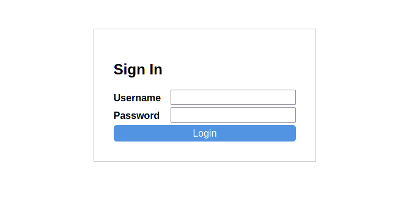
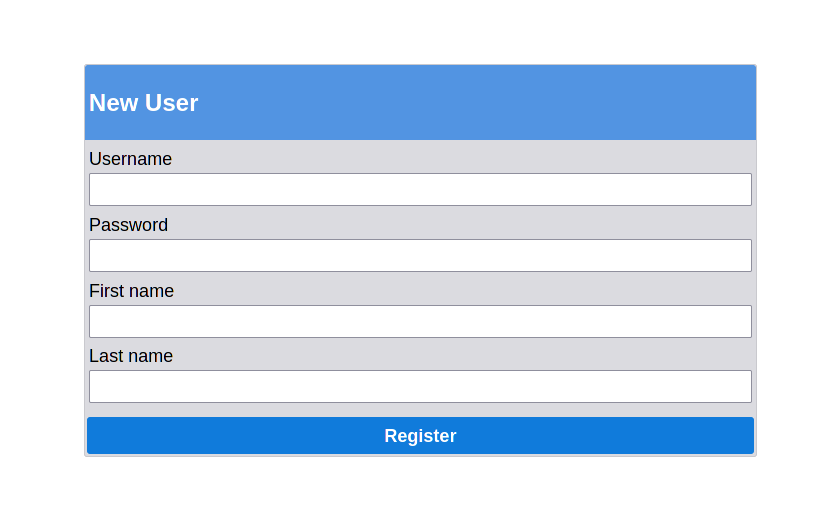
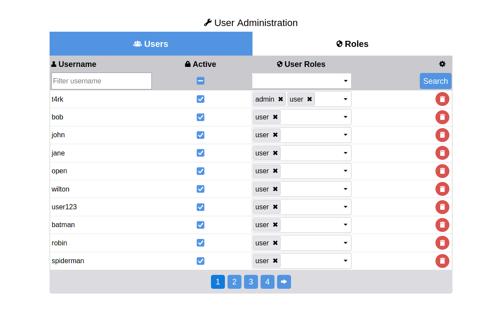

.. _authentication:

Authentication
==============

The auth system of dazzler provide components, pages and routes for authentication.
Pages marked as ``require_login`` will show a login page if not authenticated
and additional ``authorizations`` can be required on a page basis.

If a user is authenticated, it will be available in bindings via ``context.user``
and for regular aiohttp routes in ``request['user']``.

Configuration
-------------

Enable and set the authenticator to use, currently only PostgreSQL authenticator
is available natively. It's also possible to customize the authenticator,
see :ref:`Custom Authenticator <custom_auth>` for details.

.. code-block:: toml

    [authentication]
    enable = true
    authenticator = 'dazzler.contrib.postgresql:PostgresAuthenticator'

.. attention::
    `Scrypt`_ used for hashing passwords requires OpenSSL 1.1+ installed.

The default backend (how the server knows a request is authenticated)
is integrated with the session system and can be changed for a custom
implementation.

.. code-block:: toml

    [authentication]
    backend = 'module:AuthBackendImplement'

.. warning::
    The session backend is not suited for Electron applications.

Login & Logout
--------------

A user can login either with login page or a with the
:py:class:`~.dazzler.components.auth.Login` component. To logout, use
the :py:class:`~.dazzler.components.auth.Logout` component.

Login Page
^^^^^^^^^^

A default login page is included with the authentication system. Pages that
``requires_login`` will be automatically redirected here and upon login,
the initial requested page will be redirected to.

:Configuration:
    The login page can be customized with these configs:

    .. code-block:: toml

        [authentication.login]
        # Url to use by default if no next_url is available.
        default_redirect = "/"
        page_title = "Login" # Title of the login page

        # Url for the login page and related routes.
        page_url = "/auth"
        form_header = "Sign In" # Title of the login form.

Components
^^^^^^^^^^

The :py:class:`~.dazzler.component.auth.Login` and
:py:class:~`.dazzler.component.auth.Logout` components
can also be added to any existing page.

The authentication routes are under `/auth/` and can be used with components:
- ``auth.Login(login_url='/auth/login')``.
- ``auth.Logout(logout_url='/auth/logout')``.

Status
^^^^^^

To know if a page binding is authenticated, the ``user`` attribute of the
context can be checked upon. This is particularly useful to conditionally
display a login prompt or a logout.

Here's an example that either display a logout button if authenticated
or login and register links otherwise.

.. code-block:: python

    from dazzler.system import Page, BindingContext
    from dazzler.components import core, auth

    page = Page(
        __name__,
        core.Panel(
            title='User info',
            identity='user-info',
        )
    )

    @page.bind('title@user-info', once=True)
    async def on_user_info(ctx: BindingContext):
        if ctx.user:
            await ctx.set_aspect(
                'user-info',
                content=Container([
                    auth.Logout(
                        ctx.auth.logout_url,
                        style={'width': '100%'}
                    )
                ])
            )
        else:
            await ctx.set_aspect(
                'user-info',
                content=Container([
                    Box(Link(
                        children='Login',
                        page_name=ctx.auth.login_page.name
                    )),
                    Box(Link(
                        children='Register',
                        page_name=ctx.auth.register_page.name,
                    )),
                ])
            )

.. tip::
    Note the use of the context ``auth`` attribute to get the name of the
    page to link to them and the ``ctx.auth.logout_url`` for the Logout
    button. This is useful in case the default names and urls have been
    changed.

Register
--------

Add a register page to create new users.

Page settings
^^^^^^^^^^^^^

.. code-block:: toml

    [authentication.register]
    enable = true

    # Require the user to provide an email on the register page.
    require_email = true
    page_name = "register" # Name of the register page
    page_url = "/auth/register"
    custom_fields = []

Custom fields
^^^^^^^^^^^^^

Add custom fields to the register page for the user to fill.
These fields can be accessed later in the
:py:class:`~.dazzler.system.auth.User` ``metadata`` attribute as a
dict containing the values entered.

The ``custom_fields`` config is a list of list with the following structure:

``[key, label, optional type]``

**Example:**

.. code-block:: toml

    [authentication.register]
    enable = true
    require_email = false
    custom_fields = [
        ['firstname', 'First name', 'text'],
        ['lastname', 'Last name', 'text'],
    ]

Result in this register form page:

Authorizations
--------------

Each page can have it's own set of authorizations. The default behavior
of the authenticator is to compare the user role names to the page list of
authorized roles. If you have a page that requires the ``admin`` user role,
only an admin can access the page, otherwise it will result in a 403 response.

**Example**

.. code-block:: python

    page = Page(
        __name__,
        core.Container(),
        authorizations=['admin']
    )

User administration
-------------------

The user and roles can be managed with a subclass of
:py:class:`~.dazzler.pages.user_admin.UserAdminPage`.
The user list is filterable by username, active status and user roles and
allows to delete, toggle active status and add or remove user roles.

The roles tab is used to create new role to use with the application.

**Example config with PostgreSQL.**

.. code-block:: toml

    [authentication.admin]
    enable = true
    page_ref = 'dazzler.contrib.postgresql:PostgresUserAdminPage'

.. note::
    The :py:class:`~.dazzler.pages.user_admin:UserAdminPage` can be implemented
    for a custom backend.

.. attention::
    The admin module is disable by default.

.. _custom_auth:

Custom Authenticator
--------------------

It is possible to implement a custom
:py:class:`~.dazzler.system.auth.Authenticator` for other database.

Here's an example of implementing the Authenticator using hashlib scrypt
and sqlite.

Database
^^^^^^^^

Create a sqlite database with the following schema:

.. code-block:: sql

    CREATE TABLE UserAccount (
        username VARCHAR (64) PRIMARY KEY,
        email    TEXT,
        password BLOB NOT NULL,
        salt     BLOB NOT NULL
    );

.. note::
    Run ``$ sqlite3 db.sqlite`` to create the database and paste the table
    statement into the interactive client.

Create a Python db object for sqlite and an asyncio Lock to access the database
from multiple endpoints.

For convenience, we can automatically map the fetch results column names to
values with the cursor description.

.. code-block:: python
    :caption: db.py

    import asyncio
    import sqlite3

    class DB:
        database_file = 'db.sqlite'

        def __init__(self):
            self.lock = asyncio.Lock()
            self.conn = sqlite3.connect(self.database_file)

        async def execute(self, statement, *parameters):
            async with self.lock:
                return self.conn.execute(statement, parameters)

        async def fetch(self, statement, *parameters):
            async with self.lock:
                cursor = self.conn.execute(statement, parameters)
                results = cursor.fetchall()
                cursor.close()

                # Map the name of the columns with the values.
                return [
                    {d[0]: x[i] for i, d in enumerate(cursor.description)}
                    for x in results
                ]

    db = DB()

.. warning::
    While the db object will work for fast development, it is not recommended
    for a production environment. You should use a proper database.

Configurations
^^^^^^^^^^^^^^

Enable the auth module and provide a path to the Authenticator in the
configs:

.. code-block:: toml
    :caption: dazzler.toml

    ...
    [authentication]
    enable = True
    # Path to an instance or subclass of `dazzler.system.auth.Authenticator`
    authenticator = "auth:SqliteAuthenticator"
    ...

.. note::
    Generate a config file with ``dazzler dump-configs dazzler.toml``

Authenticator
^^^^^^^^^^^^^

Implement the authenticator methods, since they both use the same data, we
can extract the user fetch. The
:py:meth:`~.dazzler.system.auth.Authenticator.get_user` method is only called
when the user is saved by the auth backend.

.. code-block:: python
    :caption: auth.py

    import hashlib
    import secrets
    from dazzler.system.auth import Authenticator, User

    from .db import db

    class SqliteAuthenticator(Authenticator):

        async def _get_user(self, username):
            users = await db.fetch(
                'SELECT * FROM UserAccount WHERE username=$1', username
            )
            if len(users):
                return users[0]

        async def authenticate(self, username: str, password: str):
            userdata = await self._get_user(username)

            if not userdata:
                return  # User doesn't exist, return None to fail the process

            # Execute in a thread to prevent blocking the server since it takes
            # some time to hash password for a secure process.
            encrypted = await self.app.executor.execute(
                hashlib.scrypt,
                password.encode(),
                n=128, r=64, p=1,
                salt=userdata['salt']
            )
            valid = secrets.compare_digest(
                encrypted, userdata['password']
            )

            if valid:
                # Return a User instance that will be saved by the auth backend.
                return User(username)

        async def get_user(self, username: str) -> User:
            userdata = await self._get_user(username)
            return User(userdata['username'])

Registering users
^^^^^^^^^^^^^^^^^

Implement the authenticator method
:py:meth:`~.dazzler.auth.Authenticator.register_user`
to use with the default register page.

For each individual user, we create a unique salt that will be used to hash
the password, creating unique hashes for same passphrases.

.. code-block:: python
    :caption: auth.py

    class SqliteAuthenticator(Authenticator):

    [...]

    async def register_user(self,
        username: str,
        password: str,
        email: str = None,
        fields: dict = None,
    ):
        data = await request.post()

        salt = secrets.randbits(128).to_bytes(16, sys.byteorder)

        encrypted = await self.app.executor.execute(
            hashlib.scrypt,
            data["password"].encode(),
            n=128, r=64, p=1,
            salt=salt
        )

        try:
            cur = await db.execute(
                "INSERT INTO UserAccount VALUES ($1,$2,$3,$4)",
                data['username'],
                data['email'],
                encrypted,
                salt
            )
            cur.close()
            db.conn.commit()
        except:
            return 'Invalid username'

.. _Scrypt: https://docs.python.org/3/library/hashlib.html#hashlib.scrypt
.. _Salt: https://en.wikipedia.org/wiki/Salt_(cryptography)
